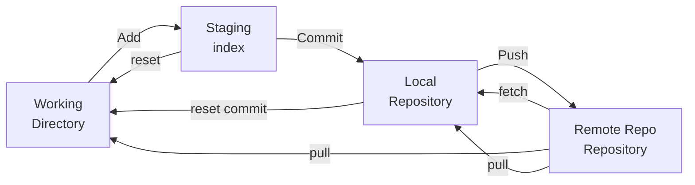

# Diagrams

```mermaid  

flowchart LR
    A[Working\nDirectory] -->|Add| B[Staging\nindex]
    B -->|Commit| C[Local\nRepository]
    C -->|Push| D[Remote Repo\nRepository]
    B -->|reset| A
    C -->|reset commit| A
    D -->|fetch| C
    D -->|pull| A & C
    
```